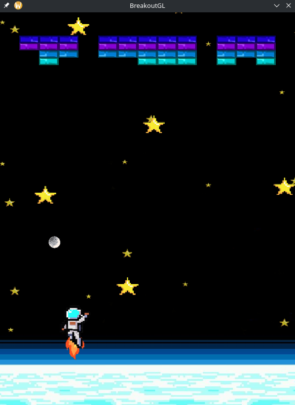

# BreakoutGL

Implementação do jogo Breakout com OpenGL em C++.

# Dependências

Para executar o projeto, é necessário ter algumas dependências instaladas no computador de forma global:

- GLFW3 (https://archlinux.org/packages/extra/x86_64/glfw/)
- GLM (https://archlinux.org/packages/extra/x86_64/glm/)
- GLAD (https://archlinux.org/packages/extra/any/glad/)

No caso do Arch Linux, os pacotes referentes às dependências podem ser baixados com os links acima via `pacman`.

O projeto possui dependências além destas, mas já estão inclusas no diretório `deps`.

O projeto pode ser executado no VScode, a partir do arquivo `tasks.json` já configurado.

# Ambiente para execução

O projeto e suas dependências foram configurados para execução em ambientes Linux apenas. Não será possível executar em ambientes Windows sem antes ajustar a pasta de dependências e a forma como os includes são feitos.

# Como jogar

O jogador pode mover o personagem utilizando as setas do teclado, para a direita ou esquerda, a fim de rebater a bola.

O jogo possui apenas um round e termina quando o jogador perder (não rebater a bola) ou quebrar todos os "tijolos". 

Em caso de vitória ou derrota, é necessário reiniciar o jogo para jogar novamente.

# Créditos e vídeo apresentação

Bruno Hoffmeister Groehs, Rafael Scholz Griebler e Théo Rossetto

https://www.youtube.com/watch?v=FsSEin0YJ5c

